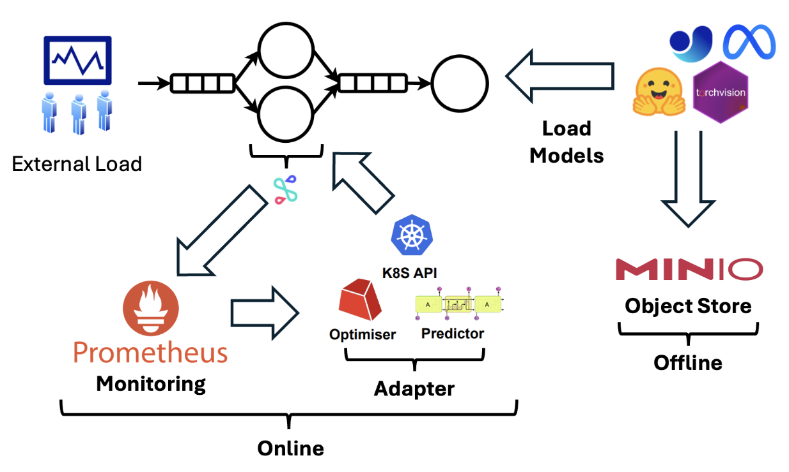

# Comments
- Start with replication of IPA [2]
- Start profiling experiments with etrace2 [1]
- Setup experiment end-to-end experiments to determine power consumption

# Problem Statement
- The InfAdapter system lacks reporting on energy consumption across different experiments
- Lacks energy efficiency benchmarks comparing against other inference-serving systems
- This limits the evaluation of InfAdapter’s overall effectiveness and sustainability in real-world deployments
- Addressing this gap is crucial for meeting industry standard sustainable AI/ML deployment

*Feature comparison table [6]*

# Solution
- Start with etrace2 and Zeus [5], to measure energy
- We aim to maximize accuracy, minimize latency, and minimize energy consumption
- We aim to benchmark IPA on different model workloads:
  - One-shot segmentation (SAM)
  - LLM

*Mapping of code modules and IPA*

# Evaluation
- Different factors take part in energy consumption. Some of the factors are:
  - Hardware
  - Model size
  - Hyperparameters (e.g. batch size)
- Energy consumption or carbon emission can be estimated using the GPUs' Thermal Design Power (TDP)
  - TDP uses maximum power consumption [4]
  - We are interested in energy consumption changes w.r.t parameters
- We aim to benchmark the energy consumption of IPA with different configurations, using tools such as Zeus for GPU [5] and etrace2 for CPU
- Moreover, we plan to have a discussion on how this metric can be optimized

# References
[[1] etrace2](https://chameleoncloud.readthedocs.io/en/latest/technical/metrics.html#energy-and-power-consumption-measurement-with-etrace2)

[[2] Ghafouri, S., Razavi, K., Salmani, M., Sanaee, A., Lorido-Botran, T., Wang, L., ... & Jamshidi, P. (2023). IPA: Inference Pipeline Adaptation to Achieve High Accuracy and Cost-Efficiency. arXiv preprint arXiv:2308.12871.](https://arxiv.org/abs/2308.12871)

[[3] Li, B., Samsi, S., Gadepally, V., & Tiwari, D. (2023, November). Clover: Toward sustainable ai with carbon-aware machine learning inference service. In Proceedings of the International Conference for High Performance Computing, Networking, Storage and Analysis (pp. 1-15).](https://dl.acm.org/doi/abs/10.1145/3581784.3607034)

[[4] Luccioni, Alexandra Sasha, Sylvain Viguier, and Anne-Laure Ligozat. "Estimating the carbon footprint of bloom, a 176b parameter language model." Journal of Machine Learning Research 24.253 (2023): 1-15.](https://www.jmlr.org/papers/v24/23-0069.html)

[[5] PyTorch. "Zeus: A New Framework for Distributed Training in PyTorch." PyTorch Blog](https://pytorch.org/blog/zeus/)

[[6] Salmani, M., Ghafouri, S., Sanaee, A., Razavi, K., Mühlhäuser, M., Doyle, J., ... & Sharifi, M. (2023, May). Reconciling high accuracy, cost-efficiency, and low latency of inference serving systems. In Proceedings of the 3rd Workshop on Machine Learning and Systems (pp. 78-86).](https://dl.acm.org/doi/abs/10.1145/3578356.3592578?casa_token=9nlFKXWZvv4AAAAA:ZOsE8kijtH3aVdXTV7EgwtSEYzE-PLc6CJd6UfxjbBmu6k80h8EvFX65sxlhNmI0CzpIFVD4OZIc)

[[7] Time-Slicing GPUs in Kubernetes](https://docs.nvidia.com/datacenter/cloud-native/gpu-operator/latest/gpu-sharing.html)

